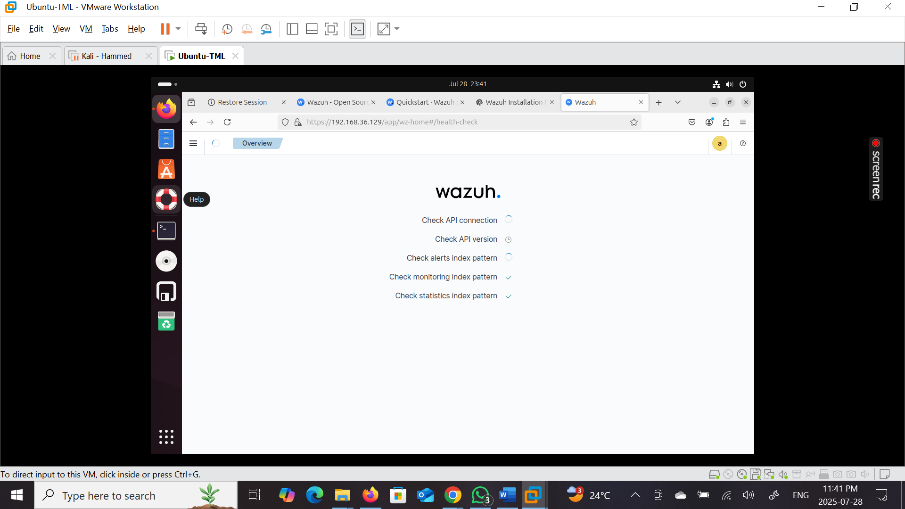
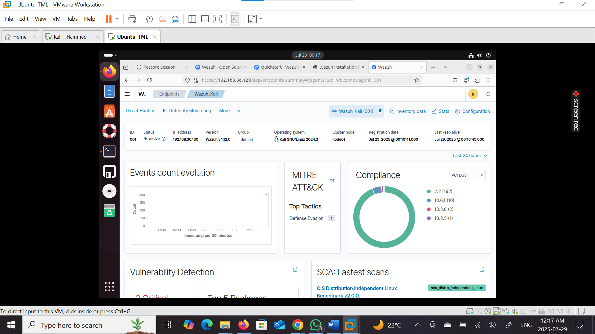

# 🚀 Wazuh SIEM Deployment (Ubuntu Server + Kali Agent)

This project demonstrates the deployment of a **Security Information and Event Management (SIEM)** solution using **Wazuh**.  
The setup uses **Ubuntu (Linux)** as the Wazuh server host and **Kali Linux** as the Wazuh agent to monitor and analyze security events.

---
---

## 🔹 Server Setup (Ubuntu – Wazuh Manager)

I deployed the Wazuh server on an Ubuntu VM and installed the Wazuh stack.

## ✅ Installation Steps:

 Download and run the Wazuh installation script

curl -sO https://packages.wazuh.com/4.12/wazuh-install.sh && sudo bash ./wazuh-install.sh -a

## 🎥 Wazuh Installation Video
[▶️ Watch the Video](https://github.com/Dynamo7001/Wazuh-SIEM-Deployment/blob/main/Wazuh%20Installation.mp4)

# ✅ Key Configurations (Wazuh Server – Ubuntu)

- Verified system hardware requirements.
- Configured the web interface (port 443).
- Generated SSL certificates for secure communication.
- Installed Wazuh indexer and dashboard components.

---

## 🔹 Agent Setup (Kali Linux – Wazuh Agent)

The Kali Linux VM was configured as an endpoint agent to send logs and events to the Wazuh server.

### ✅ Steps:
- Installed the Wazuh agent package.
- Configured the agent to connect to the Wazuh manager’s IP.
- Verified registration and communication via the dashboard.

---

## 🔹 Dashboard & Monitoring

The **Wazuh Dashboard** provides a centralized view for log monitoring and threat detection.

### 🔍 Features:
- **Events Count Evolution:** Visualizes event trends in real-time.
- **MITRE ATT&CK Mapping:** Detects tactics like *Defense Evasion*.
- **Compliance Reports:** Includes PCI DSS, CIS Benchmarks, File Integrity Monitoring.
- **Vulnerability Detection:** Identifies vulnerable packages and misconfigurations.

### 🔹 The Agent Dashboard allows:
- Monitoring logs from the Kali endpoint.
- Performing Security Configuration Assessments (SCA).
- Tracking user activity, network events, and file integrity.

---

## 📸 Screenshots

### 🔹 Wazuh Server Installation (Ubuntu)

### 🔹 Wazuh Main Dashboard

### 🔹 Wazuh Agent Dashboard (Kali Linux)

---

## 🔖 Tags:
`CyberSecurity` `SIEM` `Wazuh` `Linux` `Ubuntu` `Kali Linux` `Blue Team`  
`Threat Detection` `Incident Response` `SOC` `Open Source` `Vulnerability Management`  
`MITRE ATT&CK` `Homelab` `Security Tools`

---

## 📌 About This Project

This lab showcases a **fully functional SIEM environment** for detecting, analyzing, and responding to security events using open-source technology.  
Perfect for SOC monitoring, incident response, and compliance testing.
